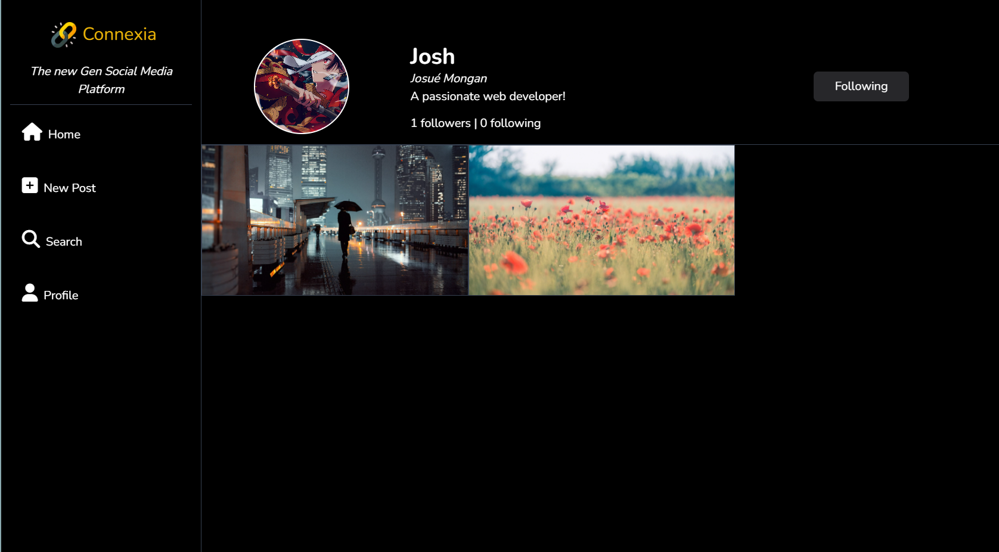

## Preview
 
 

## About the project
The project is a social media platform. It implements complex operations and relationships between models.

## How it works
Like any basic social media app, the users can create profile and connect to the app. Then, they have access to all the recent users' posts. They can like posts, comment them and even like the comments. There is an integration of emojis and stories for the users.

They can themselves add posts, follow other users and have followers. They can see another user's profile page with its username (that is unique) and its bio. On their on profile, they can change their infos, their profile picture and their story or decide to logout.

## How to start
There are certain essentials steps you must follow after **cloning the project**, in other to be able to use the app properly.

First you need to **create a database and add an admin with an email and a password**.

Secondly, you must **fill the .env file** with the good environnement variables:
MONGO_URI=
NEXT_PUBLIC_API_URL=
JWT_SECRET=

Thirdly, you run **npm run dev**

## Anyone can access this app
I've hosted it on vercel. 
Here is the link: 
So go, give it a try and leave a feedback!

## Hope you enjoy
Have fun, leave a star if you like please and any contribution or improvement is welcome.